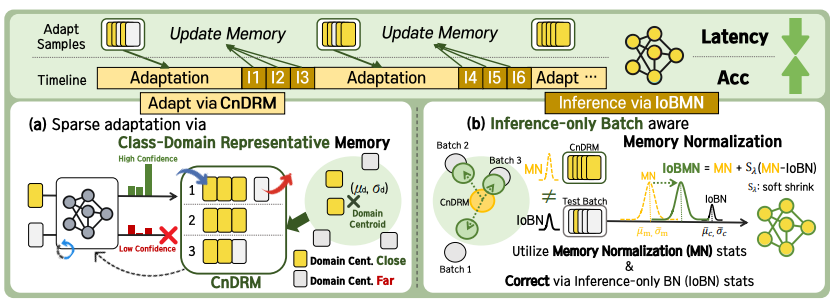

# SNAP: Low-Latency Test-Time Adaptation with Sparse Updates

   

This is the **official repository** for the NeurIPS 2025 paper *SNAP: Low-Latency Test-Time Adaptation with Sparse Updates* (Poster #119633, San Diego, Dec 3, 2025). See the conference listing [here](https://neurips.cc/virtual/2025/loc/san-diego/poster/119633), the companion project page at [nmsl.kaist.ac.kr/projects/snap](https://nmsl.kaist.ac.kr/projects/snap/), and the arXiv [2511.15276](https://arxiv.org/abs/2511.15276). This repository hosts the reference implementation used for the paper experiments, including evaluation, logging, and profiling utilities for CIFAR-10/100-C, ImageNet-C, and non-i.i.d. streaming variants.

## Contributions of SNAP
- Introduces **Class & Domain Representative Memory (CnDRM)** to subsample only the most informative test samples, enabling sparse adaptation (down to 1% of the stream) without accuracy loss.
- Proposes **Inference-only Batch-aware Memory Normalization (IoBMN)** that updates normalization statistics using CnDRM, stabilizing TTA across architectures.
- Demonstrates up to **93% latency reduction** while keeping accuracy within 3.3% of dense adaptation, validated across five SOTA TTA algorithms and three corruption benchmarks.



## Why SNAP Is Useful
- Works with popular TTA algorithms (Tent, EATA, CoTTA, SAR, RoTTA, source BN) via pluggable adaptors in `algorithm/`.
- Evaluates continual and memory-constrained (by-batch) regimes through `cta_eval.py`, matching real deployment constraints.
- Provides reproducible environments via [`snap.yaml`](snap.yaml) (conda) and [`requirements.txt`](requirements.txt) (pip) plus curated RobustBench checkpoints under `data/robustbench_models/`.
- Includes reproducible batch scripts in [`test_scripts/`](test_scripts) for large sweeps over datasets, models, and adaptation rates.
- Ships CLI utilities for log parsing, latency/memory profiling, and RobustBench dataset management under `utils/`.

## Quick Start

### 1. Environment
```bash
conda env create -f snap.yaml   # creates "snap" env (Python 3.9, CUDA 12.x stack)
conda activate snap
pip install -r requirements.txt # optional: lightweight pip flow (Python>=3.9)
```

### 2. Datasets & Checkpoints
1. Download at least one corruption benchmark:
   - CIFAR-10-C: `https://zenodo.org/records/2535967`
   - CIFAR-100-C: `https://zenodo.org/records/3555552`
   - ImageNet-C: `https://zenodo.org/record/2235448`
2. Place the extracted folders under the path referenced by `data_root` inside [`utils/config.py`](utils/config.py) (default `./data`).
3. The repo already includes RobustBench source models (`data/robustbench_models`). To use your own checkpoints, drop them next to the provided `.pt` files and update `MODEL_PATHS` if needed.

### 3. Configure Paths
`utils/config.py` autogenerates `./data`, `./checkpoint`, and Torch Hub caches. Edit `data_root` (and optionally `CHECKPOINT_ROOT`) to match your storage layout. The helper ensures directories exist when you run the scripts.

### 4. Run an Experiment
Compare naive sparse TTA (Tent) with SNAP-enhanced Tent on CIFAR-10-C corruption stream:

```bash
# naive STTA with Tent
python3 cta_eval.py --data=cifar10 --alg=tent --model=resnet18 --batch_size=16 --lr=1e-4 --device=cuda --workers=2 --test_corrupt=0 --eval_mode=continual --adaptrate=0.1 --mem_size=16 --alginf --adst=basic
# SNAP with Tent
python3 cta_eval.py --data=cifar10 --alg=tent --model=resnet18 --batch_size=16 --lr=1e-4 --device=cuda --workers=2 --test_corrupt=0 --eval_mode=continual --adaptrate=0.1 --mem_size=16 --alginf --adst=high_conf --rmst=WASS_OPP --memtype=pb --iobmn_k=1 --iobmn_s=1 --iobmn
```

- Set `--alg` to `src`, `bn`, `tent`, `cotta`, `eata`, `sar`, or `rotta` to switch methods.
- Use `--eval_mode=bybatch` when memory is limited and feed batches sequentially (requires the `*_bybatch` dataset helpers).
- Corruptions can be enumerated (`--test_corrupt=0,1,2`) or use presets: `std`, `long`, `org`.

### 5. Batch Sweeps & Logs
- Reproduce the paper’s adaptation-rate sweeps with scripts under `test_scripts/<alg>/run_*.sh` (e.g., [`test_scripts/tent/run_tent.sh`](test_scripts/tent/run_tent.sh)). These scripts loop over datasets, corruption severities, and adaptation rates, saving logs per seed.
- Summarize results via [`parse_log.py`](parse_log.py). Update `parent_txtlog_folder` to your log directory, then run `python3 parse_log.py` to emit `logs/results_all_<timestamp>.csv`.

## CLI Highlights
| Flag | Purpose |
| --- | --- |
| `--adaptrate` | Fraction of batches that trigger adaptation (others only forward pass). |
| `--adst` / `--rmst` | Memory add/remove policies (`basic`, `high_conf`, `low_entr`, `WASS_OPP`, etc.). |
| `--memtype`, `--mem_size`, `--memreset` | Control persistent buffer behavior for sparse updates. |
| `--iobmn`, `--iobmn_k`, `--iobmn_s` | Enable IOBMN batch-norm reparameterization for more stable adaptation. |
| `--accum_bn`, `--beta`, `--forget_gate` | Turn on AccumBN (`MectaNorm2d`) layers for smoother statistic tracking. |
| `--short`, `--no_log`, `--print` | Useful for profiling or silent runs.

Refer to inline help (`python3 cta_eval.py --help`) for the full option list covering dataset skew, gradient checkpointing, and memory tracking toggles.

## Profiling & Utilities
- [`profile_mem.py`](profile_mem.py) and `utils/gpu_mem_track.py`/`cpu_mem_track.py` help quantify memory pressure during continual adaptation.
- [`utils/latency_track.py`](utils/latency_track.py) and `profile_mem.py` capture per-batch latency to validate low-latency claims.
- [`utils/robustbench_loaders.py`](utils/robustbench_loaders.py) and `utils/zenodo_download.py` streamline dataset downloads and integrity checks.

## Publication & Citation
- **Conference**: Advances in Neural Information Processing Systems (NeurIPS) 2025, Poster Session (ID 119633), San Diego location.
- **Authors**: Hyeongheon Cha, Dong Min Kim, Hye Won Chung, Taesik Gong, Sung-Ju Lee.
- **Listing**: https://neurips.cc/virtual/2025/loc/san-diego/poster/119633
- **arXiv**: https://arxiv.org/abs/2511.15276
- **Project Page**: https://nmsl.kaist.ac.kr/projects/snap/

Please consider citing our paper if SNAP helps your research:
```bibtex
@inproceedings{cha2025snap,
  title     = {SNAP: Low-Latency Test-Time Adaptation with Sparse Updates},
  author    = {Hyeongheon Cha and Dong Min Kim and Hye Won Chung and Taesik Gong and Sung-Ju Lee},
  booktitle = {Advances in Neural Information Processing Systems (NeurIPS)},
  year      = {2025},
}
```
### Tested Environment

The following environment was used for testing and evaluation reported on the paper:

- **OS**: Ubuntu 22.04.2 LTS (Jammy Jellyfish)
- **GPU**: NVIDIA GeForce RTX 3090
- **GPU Driver Version**: 550.144.03
- **CUDA Version**: 12.4 (nvcc 12.4.131)
- **GCC Version**: 12.3.0
- **CPU Device**: Raspberry Pi 4

You may experience compatibility issues with different driver/CUDA versions. Please ensure consistency with this tested setup where possible.

## Acknowledgments
Parts of this implementation are inspired by the MECTA codebase: https://github.com/SonyResearch/MECTA

## Getting Help
- Search existing issues or open a new one in this repository with details about your dataset, command, and environment (`python --version`, `torch --version`).
- Attach log snippets from `cta_eval.py` or CSV summaries generated via `parse_log.py` when reporting discrepancies.
- For dataset or checkpoint download problems, consult the helper docstrings inside `utils/dataset.py` and `utils/robustbench_data.py`.
- Direct questions to Hyeongheon Cha via `hyeongheon@kaist.ac.kr`.
